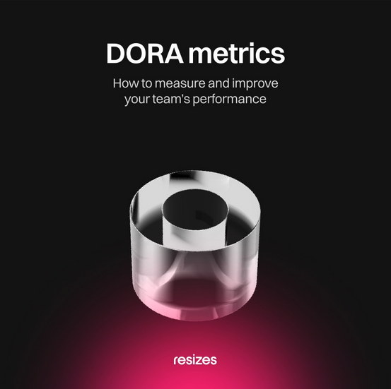
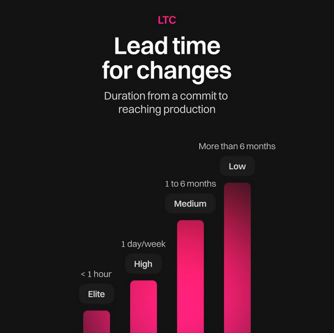
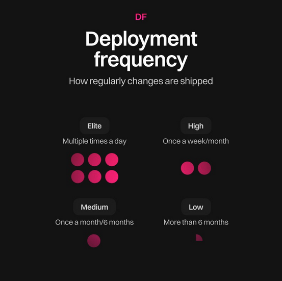
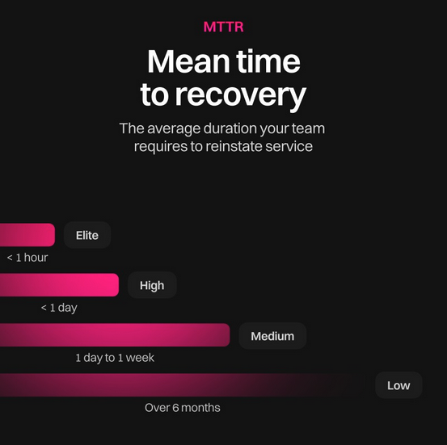
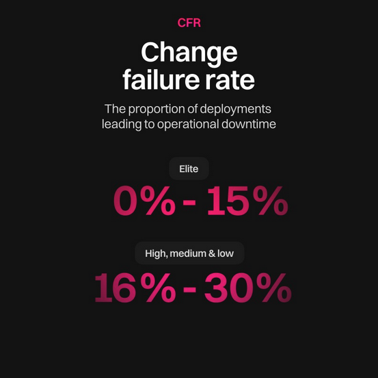

📌 Elevate your team's performance with DORA Metrics! 📊 

Unlock insights into lead time, deployment frequency, mean time to recovery and change failure rate. Learn how to optimize your DevOps practices for success. 💡

<!--truncate-->

🚀 DORA Metrics: The Key to DevOps Success 🚀