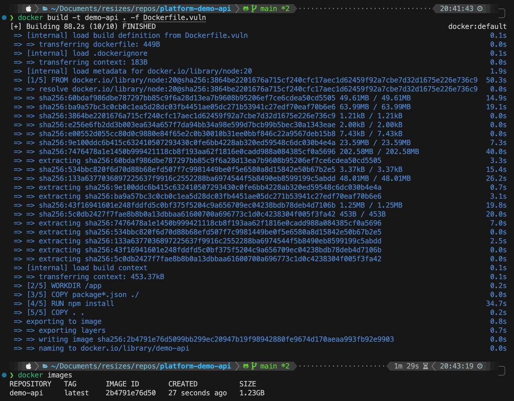
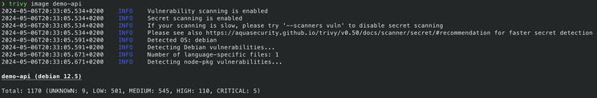
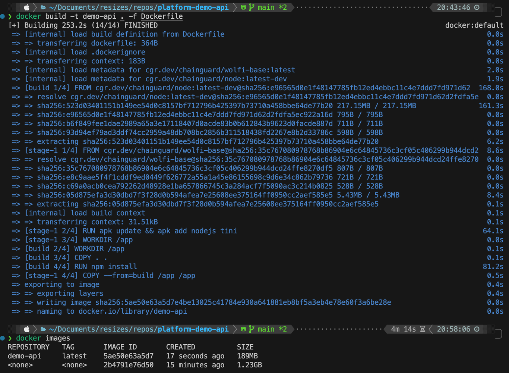
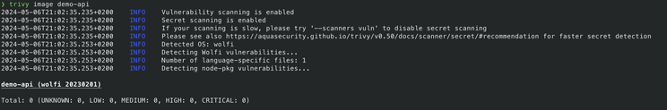

Do you know that you can reduce your application image vulnerabilities from **more than 1000 to 0**? 

Do you know that you can reduce your image application size **more than 85%**?

<!--truncate-->

## Introduction

Any piece of software can be improved, there is no perfect software out there. We can improve our software with many different strategies such as:

- Improving loops and specific programming language patterns
- Using algorithms like recursive functions
- Removing unused files or functions
- Removing unused dependencies as libraries
- etc.

In this case, we are going to focus on the application image we generate so the software is able to run on any system, like your local machine or your Kubernetes cluster. More specifically, we are going to focus on the vulnerabilities your image has and the image size of your image.

## Prerequisites

For this example, we need to have installed the following tools:

- [Docker](https://docs.docker.com/engine/install/) or any other container runtime like [Podman](https://podman.io/docs/installation)
- [Trivy](https://github.com/aquasecurity/trivy?tab=readme-ov-file#get-trivy)

## The Starting Point

I've been developing a Node.js application for a demo API. In order to create the image for my application, I was using the following `Dockerfile.vuln`:

```dockerfile
FROM node:20

# Set the working directory in the container
WORKDIR /app

# Copy the package.json and package-lock.json files to the container
COPY package*.json ./

# Install the dependencies
RUN npm install

# Copy the rest of the application code to the container
COPY . .

# Expose the port on which the application will run
EXPOSE 5200

# Start the application
CMD ["npx", "ts-node", "src/server.ts"]
````

At this point, running:

```bash
docker build -t demo-api . -f Dockerfile.vuln
```

the image size is 1.23GB:



### Let's check the vulnerabilities

Running `trivy image demo-api`, we can check the following vulnerabilities:



So we have **1170 different vulnerabilities** and 5 of them are CRITICAL!!

We have a problem. We need to solve it as soon as possible!

## The Solution

To solve the problem, we can change the `Dockerfile.vuln` so we rely on the [Chainguard](https://www.chainguard.dev/)'s Node.js image for building the application and the Chainguard's Wolfi base image for running the application so the new `Dockerfile` looks like this:

```dockerfile
FROM cgr.dev/chainguard/node:latest-dev as build

USER root

WORKDIR /app

COPY . .
RUN npm install

FROM cgr.dev/chainguard/wolfi-base

RUN apk update && apk add nodejs tini

WORKDIR /app
COPY --from=build /app /app
ENV PATH="/app/node_modules/.bin:${PATH}"

EXPOSE 5200
ENTRYPOINT ["tini", "--", "ts-node", "src/server.ts"]
```

Now we can build the image and check the differences. Let's run `docker build -t demo-api . -f Dockerfile`:



So we have reduced the image size **from 1.23GB to 189MB** which is more than **85%**! That's crazy, right?

### Let's check again the vulnerabilities

We can now run again `trivy image demo-api` to check image vulnerabilities:



After running the trivy command, we can check we reduced the vulnerabilities **from 1170 to 0**! Again, this is crazy! Marvelous!

## Conclusion

In conclusion, optimizing application images not only enhances security but also improves efficiency. As demonstrated through the transformation of a Node.js application, we significantly reduced the vulnerabilities from an overwhelming number to none, and decreased the image size by more than 85%. 

This was achieved by utilizing best practices such as removing unused dependencies and files, and employing Chainguard's images which are free for the latest version, optimizing your supply chain security.

Such practices are essential, especially in environments like Kubernetes clusters, where security and resource optimization are critical. By continually refining the application image, developers can ensure that their software remains robust, secure, and performs efficiently across various systems. This approach not only mitigates potential security risks but also contributes to a more sustainable and cost-effective software deployment.

## References

- [Adrian Mouat's video in Youtube](https://www.youtube.com/watch?v=hfpVS-UP4Yw)