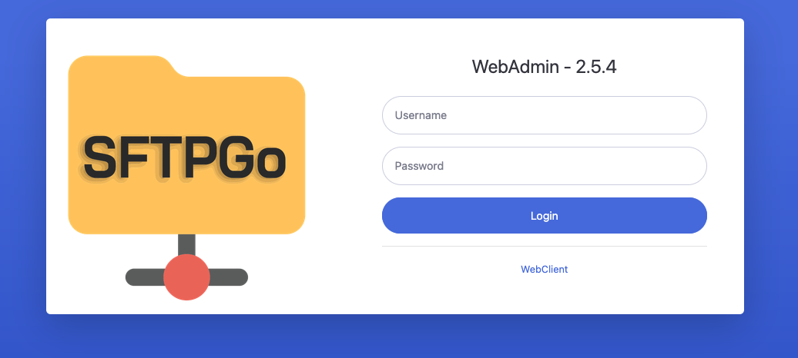

SFTPGo is an open-source SFTP server that allows users to securely transfer files over SSH. It is written in Go (Golang) and is designed to be lightweight, easy to configure, and highly customizable. It supports multiple storage backends, including local filesystems, cloud storage (like S3, Google Cloud Storage, etc.), and more.

In this case, we want to install SFTPGo on our EKS cluster, so we are going to start by creating the necessary infrastructure with Terraform.

## external-secrets.tf
We will need to create a new external secret to store all the necessary variables.

```hcl
resource "aws_secretsmanager_secret" "sftpgo" {
  name                    = "eks-production/sftpgo"
  description             = "Secrets for sftpgo in EKS production cluster"
  recovery_window_in_days = 0
}
```

Once created, we will need to enter the following variables in our Secret Manager:

- `SFTPGO_DEFAULT_ADMIN_USERNAME`: example_user


- `SFTPGO_DEFAULT_ADMIN_PASSWORD`: example_password


- `SFTPGO_DATA_PROVIDER__DRIVER`: postgresql

- `SFTPGO_DATA_PROVIDER__NAME`: sftpgo.db

>

- `SFTPGO_DATA_PROVIDER__HOST`: sftpgo-postgresql.sftpgo.svc.cluster.local *(this might be change, depends on your needs!)*

>

- `SFTPGO_DATA_PROVIDER__PORT`: 5432

>

- `SFTPGO_DATA_PROVIDER__USERNAME`: sftpgo

>

- `SFTPGO_DATA_PROVIDER__PASSWORD`: sftpgo_pg_pwd

>

# sftpgo.tf

>

On the other hand, we will also need to add a file called `sftpgo.tf` with everything related to this new SFTP (policies, IAM role, permissions, etc.).

>

We will create one role to access the **Secrets Manager** and another to **access an S3 bucket**.

>

> **Bucket s3**: We use an S3 bucket to store the documents managed in the SFTP. We can use a single bucket for everything, or if we want to separate them (e.g., for different clients), it is possible to use multiple buckets.

>

Our code would look something like this:

>

```hcl
data "aws_iam_policy_document" "sftpgo" {
  statement {
    actions = [
      "secretsmanager:GetResourcePolicy",
      "secretsmanager:GetSecretValue",
      "secretsmanager:DescribeSecret",
      "secretsmanager:ListSecretVersionIds"
    ]
    resources = [aws_secretsmanager_secret.sftpgo.arn]
  }
}

resource "aws_iam_policy" "sftpgo" {
  name        = "sftpgo"
  path        = "/"
  description = "Policy to get sftpgo secrets"
  policy      = data.aws_iam_policy_document.sftpgo.json
}

resource "aws_iam_role" "sftpgo" {
  name = "external-secrets-sftpgo"

  assume_role_policy = jsonencode({
    Version = "2012-10-17"
    Statement = [
      {
        Action = "sts:AssumeRole"
        Effect = "Allow"
        Principal = {
          AWS = "arn:aws:iam::${data.aws_caller_identity.current.account_id}:role/external-secrets"
        }
      }
    ]
  })

  depends_on = [module.external_secrets_irsa_role]
}

resource "aws_iam_policy_attachment" "sftpgo" {
  name       = "sftpgo"
  roles      = [aws_iam_role.sftpgo.name]
  policy_arn = aws_iam_policy.sftpgo.arn
}

resource "aws_s3_bucket" "example-sftpgo" {
  bucket = "example-sftpgo"
}

data "aws_iam_policy_document" "s3_full_access" {
  statement {
    actions = [
      "s3:*",  
    ]
    resources = [
      aws_s3_bucket.example-sftpgo.arn, 
      "${aws_s3_bucket.example-sftpgo.arn}/*",  
    ]
  }
}

resource "aws_iam_policy" "s3_full_access" {
  name   = "S3AccessPolicy-${aws_s3_bucket.example-sftpgo.bucket}"
  policy = data.aws_iam_policy_document.s3_full_access.json
}


resource "aws_iam_role" "irsa_role" {
  name = "sftpgo"

  assume_role_policy = jsonencode({
    Version = "2012-10-17"
    Statement = [
      {
        Effect = "Allow"
        Principal = {
          Federated = "arn:aws:iam::${data.aws_caller_identity.current.account_id}:oidc-provider/${replace(data.aws_eks_cluster.cluster.identity[0].oidc[0].issuer, "https://", "")}"
        }
        Action = "sts:AssumeRoleWithWebIdentity"
        Condition = {
          StringEquals = {
            "${replace(data.aws_eks_cluster.cluster.identity[0].oidc[0].issuer, "https://", "")}:sub" = "system:serviceaccount:sftpgo:sftpgo"
          }
        }
      }
    ]
  })
}

resource "aws_iam_role_policy_attachment" "attach_s3_policy" {
  role       = aws_iam_role.irsa_role.name
  policy_arn = aws_iam_policy.s3_full_access.arn
}

resource "aws_s3_bucket_public_access_block" "static_site_bucket_public_access" {
  bucket = aws_s3_bucket.example-sftpgo.id

  block_public_acls       = true
  block_public_policy     = true
  ignore_public_acls      = true
  restrict_public_buckets = true
}
```
>

We will also add a new data reference to our EKS cluster in our `data.tf`:

>

```hcl
data "aws_eks_cluster" "cluster" {
  name     = "example_name_cluster"
}
```

>

---

>

When everything mentioned above has been created, we can continue creating the necessary charts to set up our SFTP.

We will start by creating a new folder called sftpgo (For example, in `platform-eks-production.tf`).

>

Inside this folder, we will begin by creating the two main files: `values.yaml` and `chart.yaml`.

>

## Chart.yaml
Here we will list the different dependencies we will use and their versions. In this case, we will use **sftpgo** and **postgresql**.

>

>**Postgresql**: This is required to store the new users who will use this SFTP.

>

It should look something like this:

```yml
apiVersion: v2
name: sftpgo
description: SFTPGo - Secure SFTP Server
type: application 
version: 0.23.1
appVersion: "2.5.4"
dependencies:
  - name: sftpgo
    version: 0.23.1
    repository: "https://charts.sagikazarmark.dev"

  - name: postgresql
    version: 16.4
    repository: "https://charts.bitnami.com/bitnami"
```

>

## Values.yaml
On the other hand, there is the `values.yaml`, where we collect things like the ingress, variables (in this case, retrieved from a secret stored in AWS), the serviceAccount, etc.

>

It should looks like this:

>

```yml
sftpgo:
  config: 
    common:
      proxy_protocol: 1
    data_provider:
      create_default_admin: true 

  envFrom:
  - secretRef:
      name: sftpgo

  serviceAccount:
    annotations: 
      eks.amazonaws.com/role-arn: arn:aws:iam::account_example:role/sftpgo # this should be the IRSA role

  ui:
    ingress:
      enabled: true
      className: external
      annotations:
        kubernetes.io/external-dns.create: "true"
      hosts:
      - host: sftpgo.example.com
        paths:
        - path: /
          pathType: ImplementationSpecific
```

>

Once we have these two files, we will create the `Chart.lock` and the `charts` with the following command:

>

```sh
helm dep up
```

>

With this, a file called `charts` and a `Chart.lock` file should have been created inside our `sftpgo` folder.
>
We will also create a folder called **templates**, where we will create both `externalsecret.yaml` and `secretstore.yaml`. This will allow us to manage the secrets we have previously stored in our **Secret Manager**.

>

## secretstore.yaml

We need to create a file that allows us to manage our secrets. To do this, we will create code like the following:

>

```yml
apiVersion: external-secrets.io/v1beta1
kind: SecretStore
metadata:
  name: external-secrets-sftpgo
spec:
  provider:
    aws:
      service: SecretsManager
      role: arn:aws:iam::example_account:role/external-secrets-sftpgo
      region: us-east-1 #remember to modify this!
```

>

## externalsecret.yaml

Finally, we must create an `externalsecret.yaml` file that contains all the secrets we mentioned earlier.

```yml
apiVersion: external-secrets.io/v1beta1
kind: ExternalSecret

metadata:
  name: sftpgo
  namespace: sftpgo 

spec:
  refreshInterval: "10m"
  secretStoreRef:
    name: external-secrets-sftpgo
    kind: SecretStore

  target:
    name: sftpgo

  dataFrom:
  - extract:
      key: eks-production/sftpgo
```

>

## Test

With all our resources created, we can prove that everything is going well with several steps:

### 1. Enter the SFTPGo host
We can enter the host that we created earlier in the values.yaml (sftpgo.example.com) and we will see a login screen like the one in the following image. With what we have done, we should be able to log in as the admin user using the credentials stored in our Secret Manager.

>



>

### 2. Send a file from our local to SFTPGo.
>**Remember**: We are doing everything from a user login, so we first need to create a user in the SFTPGo UI.

>

To save a test file in SFTPGo, we will go to our terminal and log in with the following command:

>

```sh
sftp user@sftpgo.example.com
```

>

Later, after creating a test .txt file, we will save it in SFTPGo inside a folder called "example" *(We can also save it directly in the root directory; it's just a test to see the possibility of navigating and organizing files within SFTPGo)*.

>

```sh
sftp> mkdir /example  
sftp> cd /home/example
sftp> put archivo_prueba.txt
```

>

If everything has gone well, we should be able to see our file in the SFTPGo UI.

>

## Resources

[SFTPGo Docs](https://docs.sftpgo.com/latest/tutorials/postgresql-s3/)