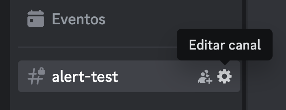

Monitoring a Kubernetes cluster is essential to know what is going on or to be able to detect if something is wrong in time There are multiple tools available for this purpose, but in this implementation, we'll use **Metrics Server**, **Alloy**, **Loki**, **Kube Prometheus Stack**, and **Alertmanager**.

This setup will be deployed on an EKS cluster, with all configurations managed through Terraform and Helm charts.

<!--truncate-->

## Infrastructure Overview

The monitoring stack consists of several components:

- **Metrics Server**: For basic resource metrics collection
- **Alloy**: To collect and forward metrics and logs
- **Loki**: For log storage and querying
- **Kube Prometheus Stack**: Comprehensive monitoring solution
- **Alertmanager**: For handling alerts and notifications

All components will be deployed using Helm charts with configurations stored in our platform repository.


## Metrics Server
Metrics Server is a tool used in Kubernetes that collects basic resource usage metrics (such as CPU and memory) from the nodes and pods in the cluster.
To implement it, we will create a `Chart.yaml` and a `values.yaml` similar to these:


Chart.yaml:
```yaml
apiVersion: v2
name: metrics-server
description: metrics-server helm chart
type: application
version: 3.12.1 # Change to the current version
dependencies:
- name: metrics-server
  version: 3.12.1 # Change to the current version
  repository: https://kubernetes-sigs.github.io/metrics-server
```


In this case, the `values.yaml` file can be empty without any issues (although you still need to create the file, even if it is empty). Then, run `helm dependency update`. This will create the necessary `Chart.lock` and `.tgz` files.


## Alloy

**Alloy** is designed to collect and send metrics, logs, etc., to different destinations, such as **Grafana**, **Loki**, or **Prometheus**.
It is the successor to **Grafana Agent**, so its configuration is similar (but not identical).


> Unlike **Grafana Agent**, which used `.river` files for configuration, Alloy uses `.alloy`.


In this case, we will use **Alloy** to send logs to **Loki**. To do this, start by creating our `Chart.yaml` and `values.yaml`.
These are just examples; you should modify them according to your needs:


Chart.yaml:
```yaml
apiVersion: v2
name: alloy
description: A Helm chart for Alloy (Promtail)
version:  0.12.3 # Change to the current version
dependencies:
- name: alloy
  version: 0.12.3 # Change to the current version
  repository: https://grafana.github.io/helm-charts
```


values.yaml:
```yaml
alloy:

  ingress:
    enabled: false
    annotations:
      kubernetes.io/external-dns.create: "true"
    ingressClassName: "external"
    faroPort: 80
    hosts:
      - alloy.example.com # Change to your domain

  alloy:
    configMap:
      create: false
      name: alloy
```


After this, run `helm dependency update` to create both the `Chart.lock` and the `.tgz` file.
Then, the next step is to create a template called `config.yaml`. This template will be used to instruct **Alloy** to load the configuration from the files that will later be placed in a folder named **config**.


```yaml
apiVersion: v1
kind: ConfigMap
metadata:
  name: alloy
data:
  config.alloy: |
    {{- range $file, $content := .Files.Glob "config/*" }}
    // {{ $file }}
    {{ $content | toString | indent 4 }}
    {{- end }}

    loki.source.file "logs" {
      targets = [
        {__path__ = "/var/log/*.log"},
      ]
      forward_to = [loki.write.default.receiver]
    }

    loki.write "default" {
    endpoint {
        url = "loki-gateway.monitoring.svc.cluster.local"  
        
        basic_auth {
            username = "loki"  
            password = "loki_password"  
        }
      }
    }
```


Now create the **config** folder mentioned earlier. Inside it, we will store two files—one containing the general configuration and another with the specific configuration for **Loki**.


default.alloy:
```
logging {
    level  = "info"
    format = "logfmt"
}

discovery.kubernetes "pods" {
    role = "pod"
}

discovery.kubernetes "services" {
    role = "service"
}

discovery.kubernetes "nodes" {
    role = "node"
}

discovery.relabel "pods_k8s_labels" {
    targets = discovery.kubernetes.pods.targets
    
    rule {
        action = "labelmap"
        regex = "__meta_kubernetes_namespace$"
        replacement = "namespace"
    }
}
discovery.relabel "services_k8s_labels" {
    targets = discovery.kubernetes.services.targets
    rule {
        action = "labelmap"
        regex = "__meta_kubernetes_(.+)"
    }
}
```


loki.alloy:
```
loki.source.kubernetes "pods" {
    targets    = discovery.relabel.pods_k8s_labels.output
    forward_to = [loki.write.loki.receiver]
}
loki.write "loki" {
    endpoint {
        url = "http://loki-gateway.monitoring.svc:80/loki/api/v1/push"
        basic_auth {
            username = "loki"
            password = "loki_password"
        }
    }
}
```

## Loki

**Loki** is a log storage and query system that can be integrated with **Grafana** or **Prometheus**.
To get started, it is necessary to create a bucket where all the collected logs will be stored :


loki.tf :
```yaml
module "loki_oidc_role" {
  source    = "terraform-aws-modules/iam/aws//modules/iam-role-for-service-accounts-eks"
  version   = "~> 5.0"
  role_name = "loki-oidc-role"
  oidc_providers = {
    oidc_provider = {
      provider_arn               = module.eks.oidc_provider_arn
      namespace_service_accounts = ["monitoring:loki"]
    }
  }
}

resource "aws_iam_policy" "loki-policy" {
  name        = "loki"
  path        = "/"
  description = "Loki IAM Policy to have access to S3 buckets"

  policy = jsonencode({
    Version = "2012-10-17"
    Statement = [
      {
        "Sid" : "lokiPermissions",
        "Effect" : "Allow",
        "Action" : [
          "s3:PutObject",
          "s3:GetObject",
          "s3:ListBucket",
          "s3:DeleteObject",
          "s3:GetObjectTagging",
          "s3:PutObjectTagging"
        ],
        "Resource" : [
          "arn:aws:s3:::${local.customer}-loki-chunks/*",
          "arn:aws:s3:::${local.customer}-loki-chunks"
        ]
      }
    ]
  })
}

resource "aws_iam_role_policy_attachment" "loki-attach" {
  role       = module.loki_oidc_role.iam_role_name
  policy_arn = aws_iam_policy.loki-policy.arn
}

resource "aws_s3_bucket" "loki_chunks" {
  bucket        = "${local.customer}-loki-chunks"
  force_destroy = true
}
```


Once the bucket is created, the next step is to generate the `Chart.yaml` and `values.yaml` files.


Chart.yaml :
```yaml
apiVersion: v2
name: loki
description: loki-distributed helm chart
type: application
version: 0.80.2 #Change to the current version
dependencies:
- name: loki-distributed
  version: 0.80.2 #Change to the current version
  repository: https://grafana.github.io/helm-charts
```


values.yaml :
```yaml
loki-distributed:
  nameOverride: loki
  loki:
    structuredConfig:
      auth_enabled: false # Enable with X-Scope-OrgID header
      compactor:
        shared_store: s3
        compaction_interval: 10m
        retention_enabled: true
        retention_delete_delay: 1m
        retention_delete_worker_count: 150
        delete_request_cancel_period: 10m

      limits_config:
        retention_period: 1y

      schema_config:
        configs:
        - from: 2020-09-07
          store: boltdb-shipper
          object_store: s3
          schema: v12
          index:
            prefix: loki_index_
            period: 24h

      storage_config:
        filesystem: null
        boltdb_shipper:
          build_per_tenant_index: true
          shared_store: s3
        aws:
          region: us-east-1 # change to your region 
          bucketnames: example-loki-chunks
          insecure: false
          s3forcepathstyle: false

  serviceAccount:
    annotations:
      eks.amazonaws.com/role-arn: arn:aws:iam::examplenumberaccount:role/loki-oidc-role # change to your AWS account

  gateway:
    basicAuth:
      enabled: true
      username: loki
      password: loki_password

  compactor:
    enabled: true
```


After this, as with the previous tools, we will run `helm dependency update` to create the `Chart.lock` and `.tgz` file.


## Kube Prometheus Stack

**Kube Prometheus Stack** is a monitoring toolset designed for *Kubernetes*, which automatically deploys components such as **Prometheus**, **Alertmanager**, and **Grafana** in your cluster.
This solution, packaged as a Helm Chart, provides everything necessary to collect metrics, configure alerts, and visualize data, with predefined dashboards for *Kubernetes*, nodes, and applications.
Here is an example of how its files would look:


Chart.yaml :
```yaml
apiVersion: v2
description: kube-prometheus-stack collects Kubernetes manifests, Grafana dashboards, and Prometheus rules combined with documentation and scripts to provide easy-to-operate end-to-end Kubernetes cluster monitoring with Prometheus using the Prometheus Operator.
icon: https://raw.githubusercontent.com/prometheus/prometheus.github.io/master/assets/prometheus_logo-cb55bb5c346.png
type: application

name: kube-prometheus-stack
version: 69.8.2 #Change to the current version
appVersion: v0.78.2
kubeVersion: ">=1.19.0-0"
home: https://github.com/prometheus-operator/kube-prometheus

dependencies: 
  - name: kube-prometheus-stack 
    version: "69.8.2" #Change to the current version
    repository: https://prometheus-community.github.io/helm-charts
```

values.yaml :

```yaml
kube-prometheus-stack: 
  # Remove some rules we cannot scrape
  defaultRules:
    rules:
      etcd: false
      kubeScheduler: false
    disabled:
      TargetDown: true
      KubePodNotReady: true
      KubeContainerWaiting: true
      KubeHpaMaxedOut: true
      KubeDeploymentReplicasMismatch: true
      KubePodNotReady: true
      NodeSystemSaturation: true
  alertmanager:
    ingress:
      enabled: true
      ingressClassName: "external"
      annotations:
        nginx.ingress.kubernetes.io/force-ssl-redirect: "true"
        kubernetes.io/external-dns.create: "true"
      pathType: ImplementationSpecific
      hosts:
        - alertmanager.example.com #Change to your domain
      paths:
        - /
    config:
      global:
        resolve_timeout: 5m
      route:
        group_by: ["alertname", "severity", "job"]
        group_wait: 30s
        group_interval: 5m
        repeat_interval: 12h
        receiver: blackhole
        routes:
          - receiver: "blackhole"
            matchers:
              - alertname = InfoInhibitor
            group_wait: 0s
            group_interval: 1m
            repeat_interval: 30s
      receivers:
        # Just an empty receiver
        - name: "blackhole"
    alertmanagerSpec:
      alertmanagerConfigSelector:
        matchLabels:
          release: kube-prometheus-stack
      alertmanagerConfigNamespaceSelector: {}

      nodeSelector:
        topology.kubernetes.io/zone: us-east-1c  # Change to your region
      
      affinity:
        nodeAffinity:
          requiredDuringSchedulingIgnoredDuringExecution:
            nodeSelectorTerms:
              - matchExpressions:
                - key: topology.kubernetes.io/zone
                  operator: In
                  values:
                  -  us-east-1c  # Change to your region

  grafana:
    enabled: true

    nodeSelector:
      topology.kubernetes.io/zone: us-east-1c  # Change to your region
  
    dashboards:
      default:
        node-exporter:
          gnetId: 1860
          revision: 32
        nodejs:
          gnetId: 11159
          revision: 1
          datasource: Prometheus

    affinity:
      nodeAffinity:
        requiredDuringSchedulingIgnoredDuringExecution:
          nodeSelectorTerms:
            - matchExpressions:
              - key: topology.kubernetes.io/zone	
                operator: In
                values:
                - us-east-1c # Change to your region 
    sidecar: 
      dashboards:
        label: grafana_dashboard
        labelValue: ""
        folderAnnotation: grafana-folder
        annotations: 
          grafana-folder: "/tmp/dashboards/Kube-Prometheus-Stack"
        provider:
          # Disallow updating provisioned dashboards from the UI
          allowUiUpdates: false
          foldersFromFilesStructure: true
      datasources:  
        uid: prometheus
        alertmanager: 
          uid: alertmanager
    additionalDataSources:
      - name: Loki
        type: loki
        access: proxy
        url: http://loki-gateway.monitoring.svc
        user: loki
        secureJsonData:
          password: loki_password

    ingress:
      enabled: true
      ingressClassName: "external"   
      annotations: 
        nginx.ingress.kubernetes.io/force-ssl-redirect: "true"
        kubernetes.io/external-dns.create: "true"
      hosts:
        - grafana.example.com #Change to your domain

  # Remove some scrapings we cannot perform
  kubeControllerManager:
    enabled: false
  kubeEtcd:
    enabled: false
  kubeScheduler:
    enabled: false
  kubeProxy:
    enabled: false

  prometheus:
    enabled: true
    ingress:
      ingressClassName: "external"
      enabled: true
      annotations:
        nginx.ingress.kubernetes.io/force-ssl-redirect: "true"
        kubernetes.io/external-dns.create: 'true'
      pathType: ImplementationSpecific
      hosts:
        - prometheus.example.com #Change to your domain
      paths:
        - /
```

Finally, run `helm dependency update` to create the charts.


## Alertmanager

**Alertmanager** is a tool used to manage and send alerts or notifications to different platforms, such as emails, messaging systems, or, in this case, Discord channels.

To add this functionality, we first need to create a webhook for the Discord channel where you want to receive these alerts. To do this, go to the *"edit this channel"* settings of the chosen channel and then navigate to **integrations**.





Once in the **integrations** window, go to **webhooks**, where you can see all existing webhooks or create a new one. To add this webhook, you need to copy its URL.


After locating our **webhook**, go to your cluster and create a new secret to store it, ensuring that the webhook URL is not publicly exposed.


```hcl
kubectl -n monitoring create secret generic discord-webhook \ --from-literal=url='https://discord.com/api/webhooks/...' #replace with your webhook URL
```


You can verify that your secret has been created correctly with the following command:


```hcl
kubectl get secrets -n monitoring
```


Next, navigate to the `values.yaml` file of the kube-prometheus-stack (the one we created earlier). In this file, locate the Alertmanager section and add the following configurations:


```yaml
  # Alertmanager configuration with secure webhook
  alertmanager:
    ingress:
      enabled: true
      ingressClassName: "external"
      annotations:
        nginx.ingress.kubernetes.io/force-ssl-redirect: "true"
        kubernetes.io/external-dns.create: "true"
      pathType: ImplementationSpecific
      hosts:
        - alertmanager.example.com
      paths:
        - /
    config:
      global:
        resolve_timeout: 5m
      route:
        group_by: ['alertname']
        group_wait: 30s
        group_interval: 5m
        repeat_interval: 12h
        receiver: 'discord' ## The receiver, in this case, is Discord.
        routes:
        - match: ## Route for this receiver
            severity: warning
          receiver: 'discord'
          continue: false
        - match:
            alertname: InfoInhibitor
          receiver: 'blackhole'
          group_wait: 0s
          group_interval: 1m
          repeat_interval: 30s
      receivers:
      - name: 'blackhole'
      - name: 'discord' ## Specification of this receiver (webhook)
        discord_configs:
        - webhook_url:
            secretKeyRef: ## Using the previously created secret
              name: discord-webhook
              key: url
    alertmanagerSpec:
      alertmanagerConfigSelector:
        matchLabels:
          release: kube-prometheus-stack
      alertmanagerConfigNamespaceSelector: {}
      nodeSelector:
        topology.kubernetes.io/zone: eu-west-1c
      affinity:
        nodeAffinity:
          requiredDuringSchedulingIgnoredDuringExecution:
            nodeSelectorTerms:
              - matchExpressions:
                - key: topology.kubernetes.io/zone
                  operator: In
                  values:
                  - eu-west-1c
```
There are still a lot of configurations or things to customize depending on your situation ... but with all this you would have your kubernetes cluster monitored in a very easy way!

## Resources

[Loki Documentation](https://grafana.com/docs/loki/latest/)
[Alloy Documentation](https://grafana.com/docs/alloy/latest/)