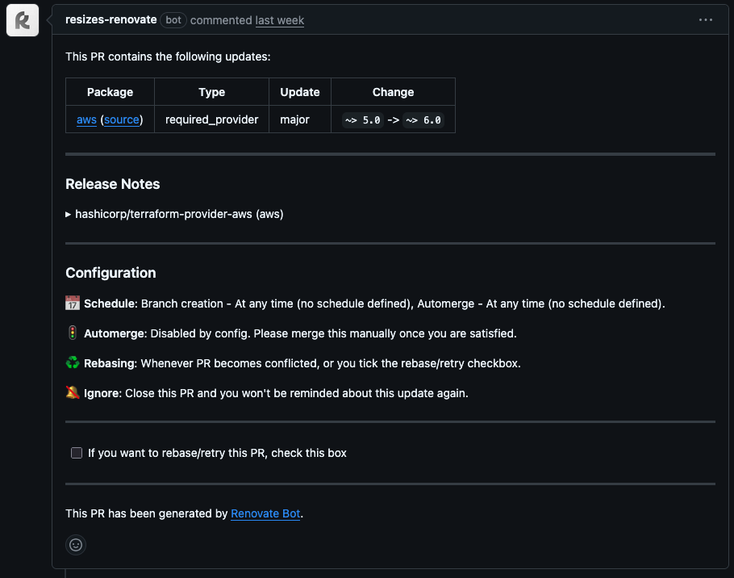

# Automating Dependency Updates with Renovate Bot (for Any Language)
Keeping dependencies up to date is one of those things that everyone agrees is important… and yet no one enjoys doing.

Between version pinning, breaking changes, and endless ``npm audit`` noise, it’s easy for dependency updates to pile up. The result? A pile of technical debt that will keep growing and growing.

**Renovate Bot is one of those tools that quietly removes that pain**. It just runs in the background, opens clean pull requests when something is outdated, and — if you let it — merges them once your tests pass. You barely have to think about it.

<!--truncate-->

## What is renovate
Renovate is an open-source tool (by Mend) that **automates dependency updates** across basically any language or ecosystem. It supports npm, pip, Terraform, Docker, Maven, Go modules, and a bunch more.

At a high level, Renovate:
- Scans your repo for dependencies.
- Checks if newer versions are available.
- Creates pull requests with the updates.

It is possible to fully customize how this process works: *When* it runs, *how* PRs are grouped or *which* dependencies not to update.

## Why it matters
### Security-First Angle
Even if your app passes SAST or container scans, outdated dependencies can hide vulnerabilities.
This is what’s called **dependency drift** — everything still runs, but the libraries you’re using have quietly accumulated known CVEs over time.

For example, a project might still be using ``lodash@4.17.19`` from a few years ago, even though several security patches have been released since. You won’t notice until an audit tool starts screaming, or worse — until someone exploits it.

Renovate helps close that gap. As soon as a patched version is available, it can automatically open a PR. In many teams, these small bumps (minor or patch releases) are auto-merged if tests pass.

It’s not a replacement for scanners like **Trivy, Semgrep, or Trufflehog** — it’s the thing that **keeps their results relevant**. They catch issues, Renovate makes sure those issues don’t come back.

### Productivity and Workflow Enhancements
There’s also the human side. **Manually tracking versions is boring**, repetitive work that burns cognitive energy.
A typical microservice might have 30–50 dependencies — checking each one regularly can take hours every month.

With Renovate, that time disappears. You just get small, tidy pull requests that you can merge when ready (or let CI handle it).


--- 

## Renovate or Dependabot?
So far, we’ve talked about all the cool parts of Renovate — but there’s one big drawback: because it’s so customizable, the configuration can get a bit dense.

On the other hand, you’ve probably heard of Dependabot — hard not to, since GitHub shows it to you almost every day. But is it better or worse than Renovate? Which one should you actually use?

At first glance, both bots do the same thing: keep your dependencies up to date. But **Dependabot’s main goal is simplicity** — a couple of clicks and you’re done. The trade-off is that you get zero configuration and, often, a flood of pull requests all at once, which can add a lot of overhead for your team.

Personally, **I stick with Renovate** because it lets me fine-tune the behavior exactly how I want it. If you prefer, you can still keep Dependabot around just for security alerts, or complement Renovate with a proper SAST stack (like the one we use [here...](https://blog.resiz.es/static-code-analysis))

---

## How renovate works
When Renovate runs, it:
 1. Looks for dependency files in your repo (package.json, requirements.txt, .tf, etc.).
 2. Checks the latest versions from the relevant registry.
 3. Compares against your current versions and your config rules.
 4. Opens a PR with changelogs, diffs, and a test run.

That’s it. The magic comes from how much you can configure it.


---

## Step-by-Step integration guide
### Option 1: GitHub App (simple setup)
1. Go to [github.com/apps/renovate](https://github.com/apps/renovate)
2. Install it on your repo
3. Merge the onboarding PR it creates

That’s it. Renovate will start sending PRs.


### Option 2: GitHub Action (fit to your needs)
1. **Create your own GitHub App for renovate**
  - Click on your profile picture → ``Settings`` → ``Your Organization`` → ``Settings``.
  - Clock on the ``Developer settings`` → ``GitHub Apps`` → ``New GitHub App``.
  - Fulfill the form:
    * The ``GitHub App name``.
    * The ``Description``.
    * The ``Homepage URL``: Set your organization or your personal profile URL. 
  - Any problem? Take a look at the [GitHub's Documentation on Creating GitHub Apps](https://docs.github.com/en/apps/creating-github-apps/registering-a-github-app/registering-a-github-app).

2. **Add your own GitHub Secrets as a Organization Level Secret**
 - ``RENOVATE_APP_ID``: The ID of your GitHub App.
 - ``RENOVATE_APP_PRIVATE_KEY``: The full private key of your GitHub App.

3. **Create your own ``renovate.json``:**
You can use this as a template and adapt it to your needs later on. Add it to your repo's root level:
```json
{
    "$schema": "https://docs.renovatebot.com/renovate-schema.json",
    "extends": [
        "config:recommended",
        ":dependencyDashboard",
        ":semanticCommits",
        ":automergeBranch"
    ],
    "timezone": "Europe/London",
    "schedule": [
        "at any time"
    ],
    "labels": [
        "renovate",
        "terraform"
    ],
    "assignees": [],
    "reviewers": [],
    "prConcurrentLimit": 0,
    "prHourlyLimit": 0,
    "rebaseWhen": "conflicted",
    "lockFileMaintenance": {
        "enabled": false
    },
    "digest": {
        "automerge": true
    },

    "packageRules": [
        {
            "description": "Terraform providers and modules",
            "matchManagers": [
                "terraform"
            ],
            "commitMessageTopic": "Terraform {{depName}}",
            "pinDigests": false
        },{
            "matchManagers": ["nvm", "node-version", "asdf"],
            "groupName": "Node.js version",
            "groupSlug": "node-version",
            "semanticCommitType": "chore",
            "semanticCommitScope": "node",
            "commitMessageTopic": "Node.js version",
            "commitMessageExtra": "update Node.js runtime version"
          },
          {
            "matchManagers": ["npm"],
            "groupName": "npm dependencies",
            "semanticCommitType": "chore",
            "semanticCommitScope": "deps"
          }
    ],
  
    "npm": {
        "enabled": true
    },
  
    "nvm": {
        "enabled": true
    },
  
    "asdf": {
        "enabled": true
    }

}
```

4. **Invoke our reusable workflow from your repo:** You can use our reusable workflow from our [GitHub Actions repo](https://github.com/resizes/github-actions/blob/feat/added-renovate/.github/workflows/renovate.yml):
```yaml
name: Renovate

on:
  schedule:
  # Run every Monday at 5:00 AM UTC
  - cron: '0 5 * * 1'
  workflow_dispatch:
    inputs:
      log_level:
        description: 'Log level'
        required: false
        default: 'info'
        type: choice
        options:
        - info
        - debug
        - trace
      dry_run:
        description: 'Dry run (no PRs will be created)'
        required: false
        default: false
        type: boolean
      force_refresh:
        description: 'Force refresh all dependencies'
        required: false
        default: false
        type: boolean

permissions:
  contents: write # To create branches and commits
  pull-requests: write # To create and update pull requests
  issues: write # For dependency dashboard (if enabled)
  checks: read # To read check status
  statuses: read # To read commit statuses
  actions: read # To read workflow runs
  security-events: read # To read security events

jobs:
  renovate:
    uses: resizes/github-actions/.github/workflows/renovate.yml@v1
    with:
      log_level: ${{ inputs.log_level }}
      dry_run: ${{ inputs.dry_run }}
      force_refresh: ${{ inputs.force_refresh }}
      runner: 'ubuntu-latest'
      github_app_id: ${{ secrets.RENOVATE_APP_ID }}
      owner: 'Resizes'
      repositories: |
        <Your repository>
    secrets:
      github_app_private_key: ${{ secrets.RENOVATE_APP_PRIVATE_KEY }}
```

--- 

## Real examples
### Node.js monorepo
We use Renovate across several Node.js services. Instead of 10+ small PRs every week, we group all devDependency bumps into one.
**Result: less noise, faster merges.**

### Terraform infra repo
Renovate updates our AWS provider versions automatically.
We used to forget about this for months — now infra updates are steady and predictable.

---

## Sample renovate.json entries
So you saw before a full example on how to configure Renovate and you may have felt overwhelmed. But, let's take a look at some basic examples so you can build your own:

### The ”Just Works” Setup
For example, you can use this as a quick configuration. It will follow the best practices while automerging minor and patch updates at a maximum rate of 2 PRs per hour. 
```json
{
  "extends": ["config:best-practices"],
  "automerge": true,
  "major": { "automerge": false },
  "prHourlyLimit": 2
}
```

### Grouping PRs
So if you actually use the example above, for sure you have noticed that there is a lot of noise going on. So let's group some version updates in the same PR:
```json
{
  (...)
  "packageRules": [
    {
      "groupName": "Dev Dependencies",
      "matchDepTypes": ["devDependencies"]
    },
    {
      "groupName": "AWS SDKs",
      "matchPackagePatterns": ["^aws"]
    }
  ]
}
```
Now, all the devDependencies will be shown in a single PR. Same with all AWS related too.

### PRs only when team is working
Renovate may have opened a PR at a moment where no one was at the office and thought *could the PRs be created at a schedule?*. Good news - you can! 
```json
{
  "schedule": ["after 9am every monday", "before 5pm every monday"],
  "timezone": "UTC"
}

```

--- 

## Tips From Experience
- Don’t enable automerge on day one — **watch how your CI handles updates** first.
- **Group dependencies** logically, by framework or team ownership. This will decrease the noise in your team's inboxes.
- **Label security updates** clearly to make them easy to spot.
- **Merge the onboarding PR** — it’s not optional.

---

## Links to public GitHub Action and README
- [GitHub Action](https://github.com/resizes/github-actions/blob/feat/added-renovate/.github/workflows/renovate.yml)
- [README](https://github.com/resizes/github-actions/tree/feat/added-renovate/.github/workflows)